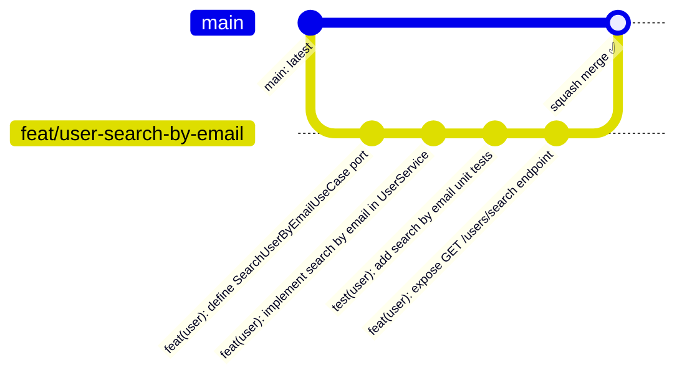
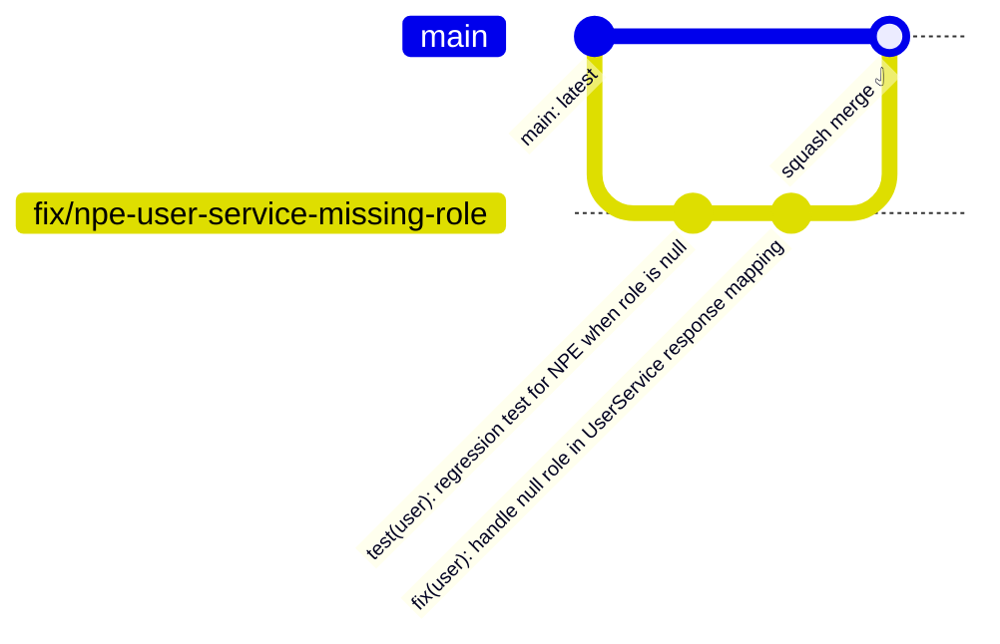
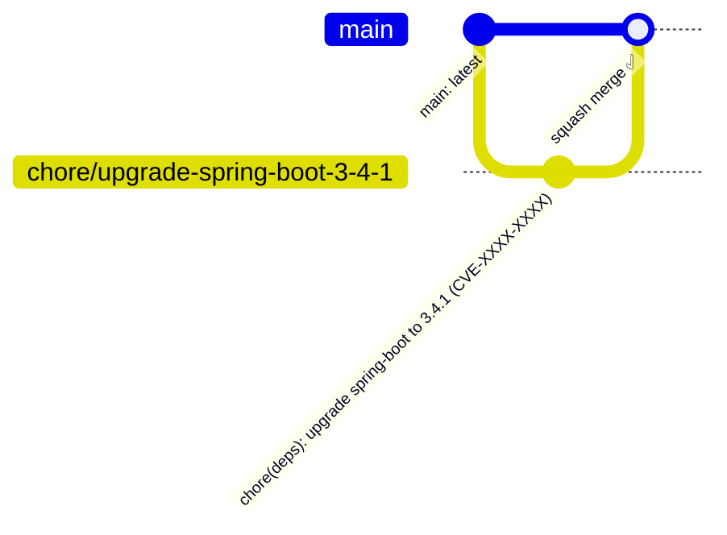
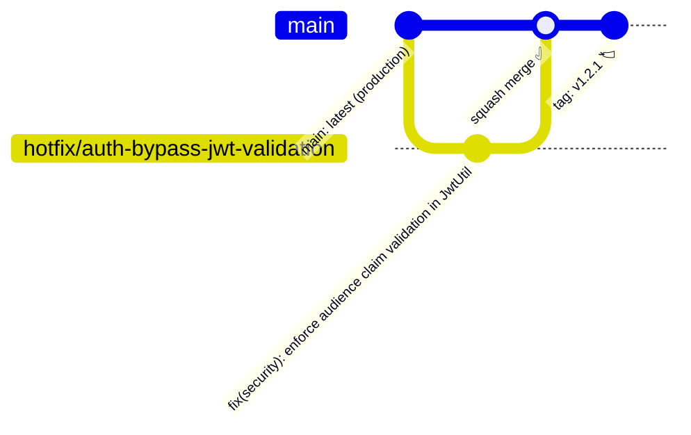
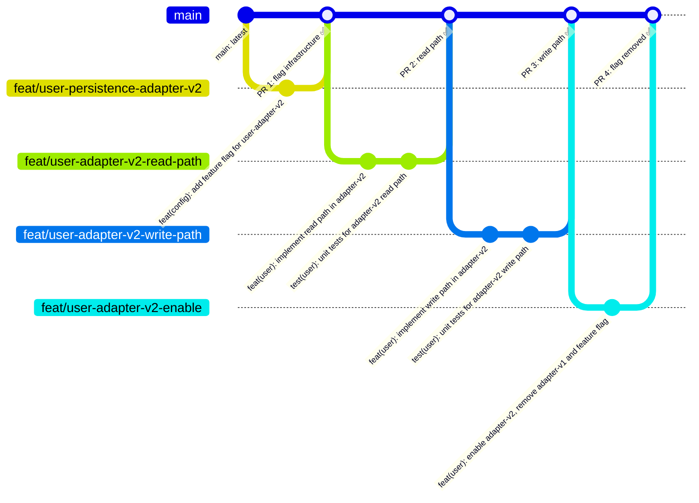

# Our Git Branching Strategy

## 🏛️ **Trunk-Based Development (TBD) with Short-Lived Feature Branches**

| Model | Why We Rejected This Model                                                                                                                                             |
|---|------------------------------------------------------------------------------------------------------------------------------------------------------------------------|
| **Git Flow** (nvie) | Too heavyweight. Long-lived `develop` + `release` + `hotfix` branches create merge hell and slow down CI/CD. Designed for scheduled releases, not continuous delivery. |
| **GitHub Flow** (single branch) | Too loose for a team with mixed experience levels. No gates between feature work and production. Works for solo contributors or very mature teams only.                |
| **GitLab Flow** | Good, but introduces environment branches (`pre-prod`, `staging`) which adds coordination overhead we don't need with proper CI/CD pipelines.                          |
| **Trunk-Based Development (pure)** | Commits directly to `main` require exceptional discipline and mature feature-flag infrastructure. Short-lived branches give us a safety gate without the overhead.     |

### ✅ Why Trunk-Based Development with Short-Lived Branches Wins

1. **Continuous Integration is real** — branches live for hours or 1–2 days max, so merge conflicts are rare and small
2. **Aligns with our CI/CD pipeline** — every push triggers `mvn -B clean verify` and the OWASP check on dependency changes
3. **Forces small, focused PRs** — as stated in our `copilot-instructions.md`
4. **Fast feedback loops** — broken builds surface immediately, not at integration time
5. **Scales with team growth** — works for 2 engineers or 20 engineers with the same rules
6. **Supports our hexagonal architecture** — domain, application, and adapter changes stay isolated in focused branches

---
## 📐 Branch Structure

```
main  ──────────────────────────────────────────────────────────▶  (production-ready always)
        │         │              │              │
        └─feat/─┘  └─fix/──────┘  └─chore/───┘  └─docs/──────┘
         (≤2 days)  (≤1 day)       (≤1 day)       (≤1 day)
```
### Branch Naming Convention
```
<type>/<short-description>

feat/add-user-search-endpoint
fix/null-pointer-in-user-service
chore/upgrade-spring-boot-3-4
docs/add-architecture-review
refactor/extract-user-mapper
test/integration-test-user-adapter
```

### Branch Lifetime Rules

| Branch Type | Max Lifetime | PR Review SLA |
|---|---|---|
| `feat/*` | 2 days | Same business day |
| `fix/*` | 1 day | Within 2 hours |
| `hotfix/*` | 4 hours | Immediate |
| `chore/*` | 1 day | Same business day |
| `docs/*` | 1 day | Async, 24h |

> ⚠️ **If your branch lives longer than 2 days, it's a design problem — break the work down.**

---

## 🔄 The Full Workflow

```
1. Pull latest main
   git checkout main && git pull origin main

2. Create a short-lived branch
   git checkout -b feat/add-user-search-endpoint

3. Make small, atomic commits (conventional commits)
   git commit -m "feat(user): add search by email query port"
   git commit -m "feat(user): implement search in UserService"
   git commit -m "test(user): unit tests for search use case"

4. Push and open PR
   git push origin feat/add-user-search-endpoint
   gh pr create --fill

5. CI runs automatically:
   mvn -B clean verify

6. Peer review → Squash and Merge to main

7. Delete branch
   git branch -d feat/add-user-search-endpoint
```

---

## ✅ Pros of This Model

| Benefit | Detail |
|---|---|
| **Minimal merge conflicts** | Small, short-lived branches touch narrow slices of the codebase |
| **True CI** | Integration happens daily, not at sprint end |
| **Clear history** | Squash merges give `main` a clean, readable log |
| **Fast hotfix path** | `hotfix/*` branches from `main` and merge back to `main` directly |
| **Matches our architecture** | Hexagonal layers = natural branch boundaries |
| **Low ceremony** | No `develop`, no `release` branches to synchronise |
| **Supports code review culture** | Every line goes through a PR — no direct pushes to `main` |

---

## ⚠️ Cons & Mitigations

| Drawback | Mitigation |
|---|---|
| **Requires discipline** | Branch age limits enforced in PR template + daily standup check |
| **No long-lived staging branch** | Use environment-based deployment (`application-local.yml`) + Docker Compose |
| **Feature flags needed for big features** | Use Spring `@ConditionalOnProperty` for incomplete features in `main` |
| **Fast-moving `main` can break beginners** | Mandatory `git pull --rebase` before every branch + team onboarding doc |
| **Squash loses individual commit context** | Enforce conventional commit messages in PR titles so `main` history stays meaningful |

---

## 👨‍💻 Examples by Role

---

### 🔵 Junior / Mid Engineer — Feature Work

**Scenario:** Add a `GET /users/search?email=` endpoint.



```bash
# 1. Always start from a fresh main
git checkout main
git pull origin main

# 2. Create your branch
git checkout -b feat/user-search-by-email

# 3. Small commits as you go — don't commit broken code
git add src/main/java/com/example/user/application/port/in/SearchUserByEmailUseCase.java
git commit -m "feat(user): define SearchUserByEmailUseCase port"

git add src/main/java/com/example/user/application/service/UserService.java
git commit -m "feat(user): implement search by email in UserService"

git add src/test/java/com/example/user/application/service/UserServiceTest.java
git commit -m "test(user): add search by email unit tests"

git add src/main/java/com/example/user/adapters/in/rest/UserController.java
git commit -m "feat(user): expose GET /users/search endpoint"

# 4. Rebase before pushing to stay current
git fetch origin
git rebase origin/main

# 5. Push and open PR
git push origin feat/user-search-by-email
gh pr create --title "feat(user): add search by email endpoint" --fill
```

> 💡 **Tip for Juniors:** Commit often, push daily. If your branch is getting large, talk to a senior — the feature may need splitting.

---

### 🟡 Mid / Senior Engineer — Bug Fix

**Scenario:** Fix a `NullPointerException` in `UserService` when user has no role assigned.



```bash
git checkout main && git pull origin main
git checkout -b fix/npe-user-service-missing-role

# Fix the code, write a regression test FIRST (TDD)
git add src/test/java/com/example/user/application/service/UserServiceTest.java
git commit -m "test(user): regression test for NPE when role is null"

git add src/main/java/com/example/user/application/service/UserService.java
git commit -m "fix(user): handle null role in UserService response mapping"

git push origin fix/npe-user-service-missing-role
gh pr create --title "fix(user): handle null role in UserService" --fill
```

> 💡 **Rule:** Every bug fix ships with a **regression test**. No exceptions.

---

### 🟠 Senior Engineer — Dependency / Security Upgrade

**Scenario:** Upgrade Spring Boot after a CVE is reported.



```bash
git checkout main && git pull origin main
git checkout -b chore/upgrade-spring-boot-3-4-1

# Edit pom.xml, then verify
mvn -B clean verify
mvn -B org.owasp:dependency-check-maven:check

git add pom.xml
git commit -m "chore(deps): upgrade spring-boot to 3.4.1 (CVE-XXXX-XXXX)"

git push origin chore/upgrade-spring-boot-3-4-1
gh pr create --title "chore(deps): upgrade spring-boot 3.4.1 — CVE fix" --fill
```

> 💡 **PR Description must include:** impacted dependency, CVE ID, severity, minimum fixed version, and compatibility notes (as per `copilot-instructions.md`).

---

### 🔴 Senior / Lead Engineer — Hotfix in Production

**Scenario:** Critical auth bypass found in production — needs immediate fix.



```bash
# Hotfix ALWAYS branches from main (main = production)
git checkout main && git pull origin main
git checkout -b hotfix/auth-bypass-jwt-validation

# Fix, test, verify
git commit -m "fix(security): enforce audience claim validation in JwtUtil"

# Run full verification before raising PR
mvn -B clean verify

git push origin hotfix/auth-bypass-jwt-validation

# Open PR with URGENT label
gh pr create \
  --title "fix(security): enforce JWT audience validation [HOTFIX]" \
  --label "hotfix,security" \
  --fill

# After merge — tag the release
git checkout main && git pull origin main
git tag -a v1.2.1 -m "hotfix: JWT audience validation bypass (CVE-XXXX)"
git push origin v1.2.1
```

> ⚠️ **Hotfixes go through PR review, even under pressure.** One reviewer minimum. No direct pushes to `main`.

---

### 🟣 Principal / Lead Engineer — Large Feature (Feature Flag Pattern)

**Scenario:** Rewrite the user persistence adapter. Too large for one branch.



```bash
# Work lands in main behind a flag — never blocks the team
git checkout -b feat/user-persistence-adapter-v2

# Use Spring conditional to hide incomplete work
# application.yml:
#   features:
#     user-adapter-v2: false

# Commit the flag infrastructure first
git commit -m "feat(config): add feature flag for user-adapter-v2"

# Deliver in slices — each slice is a separate PR
# PR 1: New adapter skeleton
# PR 2: Read path implementation
# PR 3: Write path implementation
# PR 4: Toggle flag to true + remove old adapter

# Final PR removes the flag
git commit -m "feat(user): enable adapter-v2, remove adapter-v1 and feature flag"
```

> 💡 **This is Branch by Abstraction** — Fowler's pattern for safe large-scale refactors without long-lived branches.

---

## 📋 PR Checklist (Required for All Engineers)

Every PR to `main` must satisfy:

```
- [ ] Branch name follows convention (feat/, fix/, chore/, etc.)
- [ ] Commits follow Conventional Commits format
- [ ] `mvn -B clean verify` passes locally
- [ ] No hardcoded secrets, tokens, or credentials
- [ ] New behaviour is covered by unit tests
- [ ] If dependencies changed: OWASP check passed
- [ ] If security-related: risk description in PR body
- [ ] PR description explains WHAT and WHY (not just WHAT)
- [ ] Branch is ≤ 2 days old
```

---

## 🗂️ Commit Message Convention

We follow **Conventional Commits**:

```
<type>(<scope>): <short summary>

Types:  feat | fix | docs | chore | refactor | test | perf | ci
Scope:  user | config | security | deps | api (matches our package structure)

Examples:
  feat(user): add pagination to list users endpoint
  fix(security): validate JWT expiry before processing request
  chore(deps): upgrade jackson to 2.17.1
  refactor(user): extract UserMapper from UserService
  test(user): add integration test for user creation adapter
  docs(arch): update hexagonal architecture diagram
```

---

## 🧭 Decision Summary

> We chose **Trunk-Based Development with short-lived feature branches** because it enforces the discipline of small, focused changes (matching our PR guidelines), integrates naturally with our CI pipeline (`mvn -B clean verify`), and respects the boundaries of our hexagonal architecture — keeping domain, application, and adapter concerns isolated in purpose-built branches that live for hours, not weeks.
>
> The model scales from a solo engineer to a full team without adding ceremony or infrastructure. It keeps `main` always releasable, which is the only invariant that matters in continuous delivery.
>
> — *Principal Engineer*

---

## 🔐 OWASP Dependency Check

Run the following commands **whenever dependencies change** (e.g., `pom.xml` edits):

```bash
# Standard build — always required
mvn -B clean verify

# OWASP dependency vulnerability scan — required on dependency changes
mvn -B org.owasp:dependency-check-maven:check
```

The report is generated at `target/dependency-check-report.html`.

### Severity Policy

| Severity | Policy |
|---|---|
| **CRITICAL** | 🚫 Release blocker — must fix before merge |
| **HIGH** | 🚫 Release blocker — must fix before merge |
| **MEDIUM** | ⚠️ Address in follow-up chore branch within sprint |
| **LOW** | ℹ️ Log and track — fix opportunistically |

### PR Description Requirements (dependency changes)

When raising a PR that changes dependencies, always include:

```
- **Dependency:** e.g. `org.springframework.boot:spring-boot-starter` 3.3.0 → 3.4.1
- **CVE:** CVE-XXXX-XXXXX
- **Severity:** HIGH / CRITICAL
- **Minimum fixed version:** 3.4.1
- **Risk / Compatibility notes:** e.g. No breaking API changes; minor auto-configuration adjustments required.
```

> ⚠️ Do **not** merge a dependency PR until the OWASP check passes with no HIGH or CRITICAL findings.

---

## 🛡️ Enforcement

These rules are enforced at **four layers** — from local machine to GitHub:

---

### 1. GitHub Branch Protection Rules
Go to **Settings → Branches → Add rule** on `main`:

| Setting | Value |
|---|---|
| Require a pull request before merging | ✅ |
| Required approvals | `1` minimum |
| Dismiss stale reviews on new commits | ✅ |
| Require status checks to pass (`mvn -B clean verify`) | ✅ |
| Require branches to be up to date before merging | ✅ |
| Restrict direct pushes to `main` | ✅ (admins included) |
| Allow force pushes | ❌ |
| Allow deletions of `main` | ❌ |

> Set this via CLI:
> ```bash
> gh api repos/:owner/:repo/branches/main/protection \
>   --method PUT \
>   --field required_status_checks='{"strict":true,"contexts":["build"]}' \
>   --field enforce_admins=true \
>   --field required_pull_request_reviews='{"required_approving_review_count":1}' \
>   --field restrictions=null
> ```

---

### 2. GitHub Actions CI Gate
Create `.github/workflows/ci.yml` — this is the required status check:

```yaml
name: CI

on:
  push:
    branches-ignore: [main]
  pull_request:
    branches: [main]

jobs:
  build:
    runs-on: ubuntu-latest
    steps:
      - uses: actions/checkout@v4
      - uses: actions/setup-java@v4
        with:
          java-version: '21'
          distribution: 'temurin'
      - name: Build & Test
        run: mvn -B clean verify
      - name: OWASP Dependency Check
        run: mvn -B org.owasp:dependency-check-maven:check
        # Only runs when pom.xml has changed
        if: contains(github.event.pull_request.changed_files, 'pom.xml') || github.event_name == 'push'
```

> ⚠️ A PR **cannot be merged** until this workflow passes — enforced by branch protection above.

---

### 3. PR Template
Create `.github/pull_request_template.md` to enforce PR description quality:

```markdown
## Summary
<!-- WHAT changed and WHY -->

## Type of Change
- [ ] feat — new feature
- [ ] fix — bug fix
- [ ] chore — dependency/config change
- [ ] docs — documentation only
- [ ] refactor — no behaviour change
- [ ] hotfix — critical production fix

## Checklist
- [ ] Branch name follows convention (`feat/`, `fix/`, `chore/`, etc.)
- [ ] Commits follow Conventional Commits format
- [ ] `mvn -B clean verify` passes locally
- [ ] No hardcoded secrets, tokens, or credentials
- [ ] New behaviour is covered by unit tests
- [ ] Branch is ≤ 2 days old
- [ ] If dependencies changed: OWASP check passed and results below

## Dependency Change Details *(if applicable)*
- **Dependency:**
- **CVE:**
- **Severity:**
- **Minimum fixed version:**
- **Risk / Compatibility notes:**
```

---

### 4. Local Git Hooks (pre-push)
Install a `pre-push` hook to catch failures before they reach CI:

```bash
# Create the hook
cat > .git/hooks/pre-push << 'EOF'
#!/bin/sh
echo "🔍 Running mvn -B clean verify before push..."
mvn -B clean verify
if [ $? -ne 0 ]; then
  echo "❌ Build failed. Push aborted."
  exit 1
fi
echo "✅ Build passed. Pushing..."
EOF

chmod +x .git/hooks/pre-push
```

> 💡 Use [**Lefthook**](https://github.com/evilmartians/lefthook) or [**Husky**](https://typicode.github.io/husky/) to share hooks across the team via the repo (`.git/hooks` is not committed).

---

### Enforcement Summary

| Rule | Enforced By |
|---|---|
| No direct push to `main` | Branch protection |
| PR requires 1 approval | Branch protection |
| Build must pass | GitHub Actions + branch protection status check |
| OWASP check on `pom.xml` changes | GitHub Actions |
| PR description quality | PR template |
| Conventional commits | PR title linting (optional: `commitlint` in CI) |
| Build passes locally | `pre-push` git hook |

---

## 📚 Further Reading

- [Trunk Based Development](https://trunkbaseddevelopment.com) — Paul Hammant
- [Branch by Abstraction](https://martinfowler.com/bliki/BranchByAbstraction.html) — Martin Fowler
- [Conventional Commits](https://www.conventionalcommits.org)
- [A successful Git branching model (Git Flow)](https://nvie.com/posts/a-successful-git-branching-model/) — original nvie post (2010) with 2020 retrospective
- [GitHub Flow](https://docs.github.com/en/get-started/using-github/github-flow)

