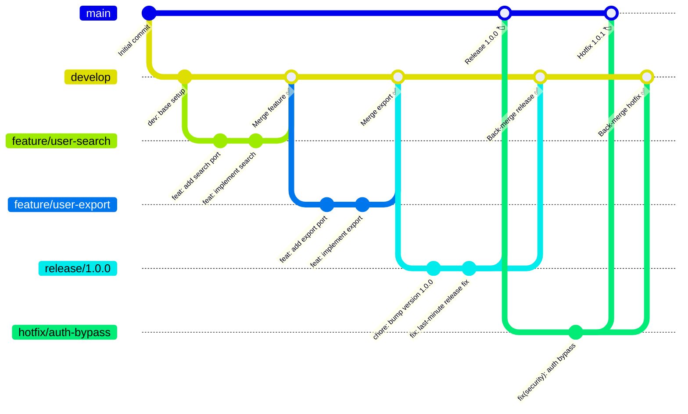
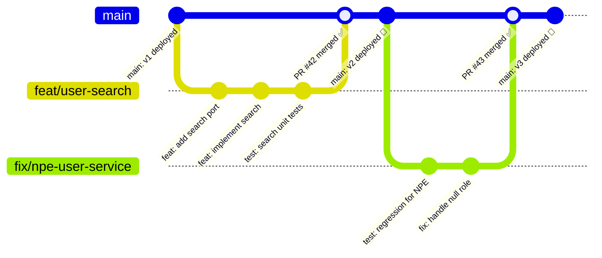
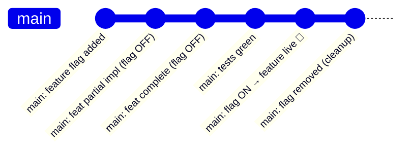
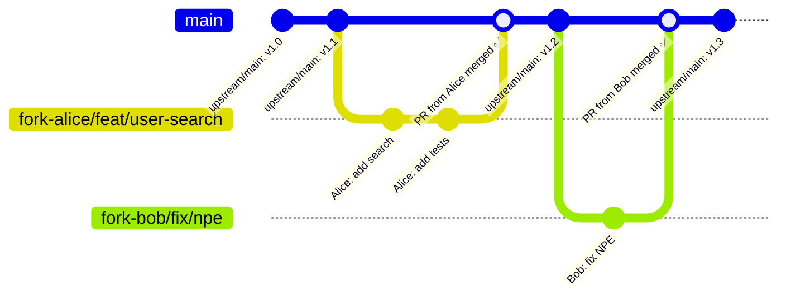
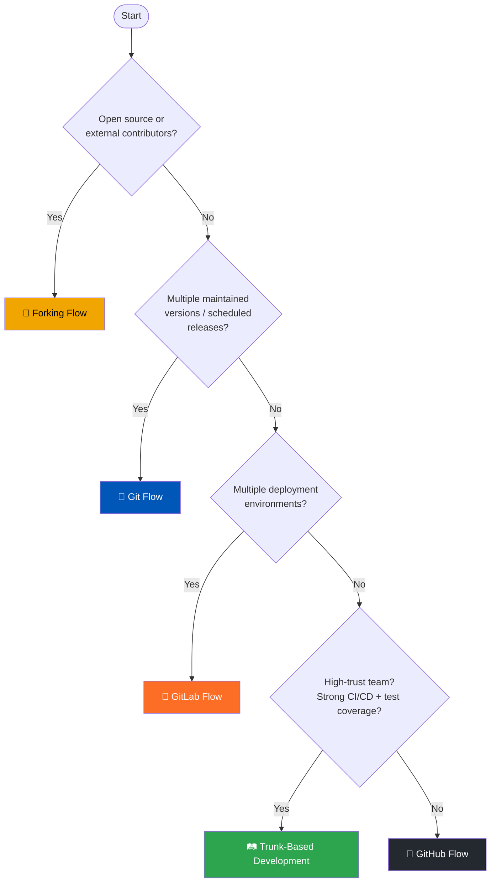
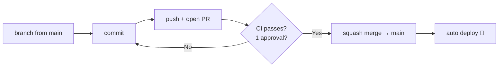

# Git Branching Strategies — Comparison Guide

A practical comparison of the most widely adopted Git branching strategies, with Mermaid diagrams and real-world commands for each.

---

## 📊 Quick Comparison

| Strategy | Complexity | Release Cadence | Best For |
|---|---|---|---|
| **Git Flow** | High | Scheduled / versioned | Enterprise, libraries, versioned APIs |
| **GitHub Flow** | Low | Continuous delivery | SaaS, small/medium teams |
| **GitLab Flow** | Medium | Environment-driven | Multi-env deployments |
| **Trunk-Based Development** | Low–Medium | Continuous deployment | High-trust teams, feature flags |
| **Forking Flow** | Medium | Varies | Open source, external contributors |

---

## 1. 🌊 Git Flow

**Created by:** Vincent Driessen (nvie)

### Overview
Git Flow introduces long-lived `develop` and `main` branches, plus supporting branches for features, releases, and hotfixes. Best for projects with **scheduled releases** and multiple maintained versions.

### Branch Types

| Branch | Purpose | Branches from | Merges into |
|---|---|---|---|
| `main` | Production-ready code | — | — |
| `develop` | Integration branch | `main` | `main` via `release/*` |
| `feature/*` | New features | `develop` | `develop` |
| `release/*` | Release preparation | `develop` | `main` + `develop` |
| `hotfix/*` | Production critical fixes | `main` | `main` + `develop` |

### Diagram



### Commands

```bash
# 1. Start a feature
git checkout develop
git pull origin develop
git checkout -b feature/user-search

# 2. Work and commit
git add .
git commit -m "feat(user): implement search by email"

# 3. Finish feature — merge back to develop
git checkout develop
git merge --no-ff feature/user-search
git branch -d feature/user-search
git push origin develop

# 4. Start a release
git checkout develop
git checkout -b release/1.0.0
# bump version in pom.xml, update CHANGELOG
git commit -am "chore: bump version to 1.0.0"

# 5. Finish release
git checkout main
git merge --no-ff release/1.0.0
git tag -a v1.0.0 -m "Release 1.0.0"
git checkout develop
git merge --no-ff release/1.0.0
git branch -d release/1.0.0
git push origin main develop --tags

# 6. Hotfix
git checkout main
git checkout -b hotfix/auth-bypass
git commit -am "fix(security): enforce audience claim in JwtUtil"
git checkout main
git merge --no-ff hotfix/auth-bypass
git tag -a v1.0.1 -m "Hotfix 1.0.1"
git checkout develop
git merge --no-ff hotfix/auth-bypass
git branch -d hotfix/auth-bypass
git push origin main develop --tags
```

### ✅ Pros / ❌ Cons
- ✅ Very structured — clear rules for every scenario
- ✅ Parallel version support
- ✅ Hotfix process is explicit
- ❌ Complex — high branch management overhead
- ❌ Long-lived branches invite merge conflicts
- ❌ Not suited for continuous delivery

---

## 2. 🐙 GitHub Flow

**Popularised by:** GitHub

### Overview
Simple, lightweight, and continuous. Every change goes through a short-lived feature branch and merges directly into `main` via a Pull Request. `main` is **always deployable**.

### Branch Types

| Branch | Purpose |
|---|---|
| `main` | Always deployable production code |
| `<type>/<description>` | Any change — feature, fix, chore, docs |

### Diagram



### Commands

```bash
# 1. Always start from latest main
git checkout main
git pull origin main

# 2. Create a short-lived branch
git checkout -b feat/user-search

# 3. Commit small, focused changes
git add src/main/java/com/example/user/
git commit -m "feat(user): implement search by email"

# 4. Push and open PR immediately (even if WIP)
git push -u origin feat/user-search
gh pr create --title "feat(user): search by email" --body "Closes #12"

# 5. After review and CI passes — squash merge
gh pr merge --squash --delete-branch

# 6. Deploy automatically (CI/CD picks up main)
```

### ✅ Pros / ❌ Cons
- ✅ Extremely simple — one rule: `main` is always deployable
- ✅ Fast feedback via short-lived branches
- ✅ Great CI/CD integration
- ❌ No built-in release management
- ❌ Requires mature CI/CD pipeline and test coverage
- ❌ Hard to manage multiple production versions

---

## 3. 🦊 GitLab Flow

**Popularised by:** GitLab

### Overview
GitLab Flow extends GitHub Flow by adding **environment branches** (`staging`, `production`) or **release branches**. Changes flow downstream: `main → staging → production`. Balances simplicity with environment promotion.

### Branch Types

| Branch | Purpose |
|---|---|
| `main` | Trunk / integration |
| `feature/*` | Short-lived feature branches |
| `staging` | Mirror of staging environment |
| `production` | Mirror of production environment |
| `release/*` | Optional — versioned releases |

### Diagram

```mermaid
gitGraph
   commit id: "main: base"
   branch feature/user-export
   checkout feature/user-export
   commit id: "feat: export CSV port"
   commit id: "feat: implement CSV export"
   checkout main
   merge feature/user-export id: "PR merged → main ✅"
   commit id: "main: ready"

   branch staging
   checkout staging
   merge main id: "Deploy to staging 🧪"
   commit id: "staging: smoke tests pass"

   branch production
   checkout production
   merge staging id: "Deploy to production 🚀"
   commit id: "production: v1.1 live"

   checkout main
   branch fix/export-encoding
   checkout fix/export-encoding
   commit id: "fix: UTF-8 encoding in CSV"
   checkout main
   merge fix/export-encoding id: "Fix merged → main ✅"
   checkout staging
   merge main id: "Re-deploy staging 🧪"
   checkout production
   merge staging id: "Re-deploy production 🚀"
```

### Commands

```bash
# 1. Feature work — same as GitHub Flow
git checkout main && git pull origin main
git checkout -b feature/user-export
git commit -am "feat(user): implement CSV export"
git push -u origin feature/user-export
gh pr create --base main

# 2. Promote main → staging
git checkout staging
git merge main
git push origin staging
# CI/CD auto-deploys staging on push

# 3. Promote staging → production after validation
git checkout production
git merge staging
git push origin production
# CI/CD auto-deploys production on push

# 4. Versioned release variant (optional)
git checkout -b release/2.0
git push origin release/2.0
# Cherry-pick specific fixes onto this branch
git cherry-pick <commit-sha>
```

### ✅ Pros / ❌ Cons
- ✅ Environment promotion is explicit and auditable
- ✅ Works well with GitOps and CD pipelines
- ✅ Supports both versioned and continuous delivery
- ❌ Environment branches can drift from `main`
- ❌ More branches to manage than GitHub Flow
- ❌ Cherry-picks can be error-prone for hotfixes

---

## 4. 🛤️ Trunk-Based Development (TBD)

**Popularised by:** Google, Facebook, DORA research

### Overview
Everyone commits directly to `main` (the "trunk") or via **very short-lived branches (< 24h)**. Feature flags gate incomplete work. This is the strategy with the strongest correlation to high software delivery performance per the DORA report.

### Branch Types

| Branch | Purpose |
|---|---|
| `main` | Trunk — commits land here frequently |
| `feat/<ticket>` | Optional, max 1–2 days old |

### Diagram (Small Team — Direct to Trunk)



### Diagram (Larger Team — Short-Lived Branches)

```mermaid
gitGraph
   commit id: "main: base"
   branch feat/USER-42
   checkout feat/USER-42
   commit id: "feat: partial search (flag OFF)"
   commit id: "test: search tests"
   checkout main
   merge feat/USER-42 id: "PR merged < 24h ✅"
   commit id: "main: search complete (flag OFF)"
   commit id: "main: enable flag → live 🚀"

   branch feat/USER-55
   checkout feat/USER-55
   commit id: "fix: encoding"
   checkout main
   merge feat/USER-55 id: "PR merged < 24h ✅"
```

### Commands

```bash
# 1. Pull trunk frequently (multiple times a day)
git checkout main
git pull origin main

# 2. Option A — commit directly to trunk (small teams)
git add src/
git commit -m "feat(user): search behind feature flag [FLAG=user.search.enabled]"
git push origin main

# 3. Option B — short-lived branch (< 24h)
git checkout -b feat/USER-42
git commit -am "feat(user): implement search"
git push -u origin feat/USER-42
gh pr create --base main --title "feat(user): search by email [USER-42]"
# Merge same day — no long review cycles

# 4. Feature flag toggle (Spring Boot example)
# application.yml
# features:
#   user-search-enabled: false  ← off during development
#   user-search-enabled: true   ← on when ready to release

# 5. Cleanup — remove flag after full rollout
git commit -am "chore(user): remove user-search feature flag"
```

### Feature Flag — Spring Boot Example

```java
// application.yml
// features:
//   user-search-enabled: true

@RestController
@RequestMapping("/users")
public class UserController {

    @Value("${features.user-search-enabled:false}")
    private boolean userSearchEnabled;

    @GetMapping("/search")
    public ResponseEntity<?> search(@RequestParam String email) {
        if (!userSearchEnabled) {
            return ResponseEntity.status(HttpStatus.NOT_FOUND).build();
        }
        return ResponseEntity.ok(userService.searchByEmail(email));
    }
}
```

### ✅ Pros / ❌ Cons
- ✅ Highest correlation with elite software delivery (DORA)
- ✅ Eliminates long-lived branch merge hell
- ✅ Continuous integration is real — not just CI tooling
- ❌ Requires discipline: feature flags, comprehensive tests, high trust
- ❌ Harder to onboard junior engineers safely
- ❌ Incomplete features temporarily live in `main` (mitigated by flags)

---

## 5. 🍴 Forking Flow

**Popularised by:** Open source projects (Linux, Apache, GitHub OSS)

### Overview
Every contributor forks the **upstream** repository into their own copy. All work happens in the fork. Changes reach the upstream via Pull Requests. Maintainers never give write access to contributors.

### Diagram



### Commands

```bash
# 1. Fork on GitHub (one-time)
gh repo fork org/hexagonal-demo --clone

# 2. Set upstream remote
git remote add upstream https://github.com/org/hexagonal-demo.git
git remote -v
# origin    https://github.com/your-username/hexagonal-demo.git
# upstream  https://github.com/org/hexagonal-demo.git

# 3. Sync fork with upstream before starting work
git fetch upstream
git checkout main
git merge upstream/main
git push origin main

# 4. Create branch in YOUR fork
git checkout -b feat/user-search

# 5. Commit and push to fork
git commit -am "feat(user): search by email"
git push origin feat/user-search

# 6. Open PR from fork → upstream
gh pr create \
  --repo org/hexagonal-demo \
  --head your-username:feat/user-search \
  --title "feat(user): search by email" \
  --body "Closes #12"

# 7. Sync fork after PR is merged
git fetch upstream
git checkout main
git merge upstream/main
git push origin main
git branch -d feat/user-search
```

### ✅ Pros / ❌ Cons
- ✅ Maintainers retain full control — no external write access
- ✅ Natural for open source contribution workflows
- ✅ Contributors can experiment freely in their fork
- ❌ Keeping fork in sync with upstream requires discipline
- ❌ Overhead for internal teams — unnecessary for closed-source
- ❌ Long-running forks diverge quickly

---

## 🔁 Strategy Decision Flowchart



---

## 📋 Side-by-Side Summary

| | Git Flow | GitHub Flow | GitLab Flow | TBD | Forking Flow |
|---|---|---|---|---|---|
| **`main` always deployable** | ❌ | ✅ | ✅ | ✅ | ✅ |
| **Long-lived branches** | ✅ `develop` | ❌ | ⚠️ env branches | ❌ | ❌ |
| **Release management** | ✅ Explicit | ❌ Tag only | ✅ Optional | ❌ Continuous | Varies |
| **Feature flags needed** | ❌ | ❌ | ❌ | ✅ | ❌ |
| **Hotfix process** | ✅ Formal | ⚡ Just branch | ⚡ Just branch | ⚡ Commit/flag | ⚡ Just branch |
| **CI/CD maturity needed** | Low | Medium | Medium | High | Low–Medium |
| **Team size sweet spot** | Any | Small–Medium | Medium–Large | Any (high trust) | Open source |
| **DORA performance** | ⭐⭐ | ⭐⭐⭐ | ⭐⭐⭐ | ⭐⭐⭐⭐⭐ | ⭐⭐ |

---

## 🏗️ This Repository: GitHub Flow

This project uses **GitHub Flow** — see [`git-our-team.md`](./git-our-team.md) for team conventions, enforcement, and PR requirements.



---

## 📚 Further Reading

- [A successful Git branching model — Vincent Driessen](https://nvie.com/posts/a-successful-git-branching-model/)
- [GitHub Flow — GitHub Docs](https://docs.github.com/en/get-started/using-github/github-flow)
- [GitLab Flow — GitLab Docs](https://about.gitlab.com/topics/version-control/what-is-gitlab-flow/)
- [Trunk Based Development — trunkbaseddevelopment.com](https://trunkbaseddevelopment.com/)
- [DORA State of DevOps Report](https://dora.dev/research/)

